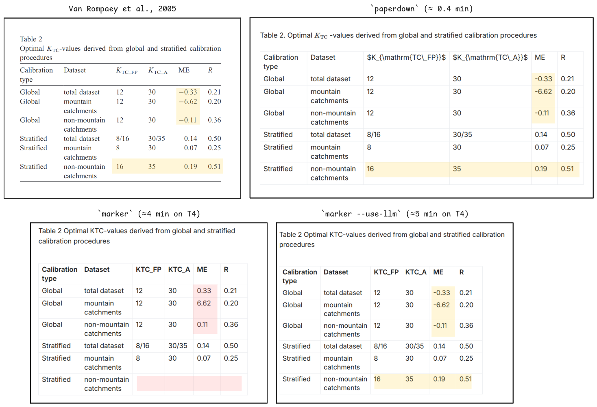

<h1 align=center><code>paperdown</code></h1>

<p align="center">
    <a href="https://github.com/atsyplenkov/paperdown/releases">
        </a>
    <a href="https://crates.io/crates/paperdown/">
        </a>
    <a href="https://codecov.io/gh/atsyplenkov/paperdown">
        </a>
    <br>
    <a href="https://github.com/atsyplenkov/paperdown/actions/workflows/rust-ci.yml">
        </a>
    <a href="https://github.com/atsyplenkov/paperdown/actions/workflows/rust-cd.yml">
        </a>
    <a href="https://docs.rs/paperdown/">
        </a>
    <br>
</p>

`paperdown` converts research papers from PDF to Markdown using Z.AI's [GLM-OCR](https://github.com/zai-org/GLM-OCR) model and downloads referenced figure assets locally.

If you work with academic papers, you know that the OCR process itself is not the most difficult part. The real challenge is cleaning up the output. Tables can disappear, their structure can become jumbled, and formulas might be converted into meaningless text. This often means you spend more time correcting the output than working with it.

I used to rely on [`marker`](https://github.com/datalab-to/marker) for PDF parsing and thought it was great. However, after converting the [Batista et al. (2022)](https://hess.copernicus.org/articles/26/3753/2022/) article one day, I discovered that Table 4 was missing, regardless of the settings or LLMs I used (via the `--use-llm` flag). I then switched to [`docling`](https://github.com/docling-project/docling), and Table 4 reappeared, but all the formulas were gone. Furthermore, both tools require a GPU, and even on a Google Colab T4 instance, processing one article takes 4 to 5 minutes.

Therefore, this project was created because, while [`docling`](https://github.com/docling-project/docling) and [`marker`](https://github.com/datalab-to/marker) are both good tools, they can sometimes miss tables or mix up table structures in ways that require manual correction. I wanted a simple, reliable process that produces a Markdown index file I can trust, local `figures/` and optional `tables/` folders, and the ability to process my entire library quickly on my laptop.

## Features

- Async OCR requests and batch PDF processing using the Z.AI API.
- Concurrent figure downloads for each PDF.
- Fast processing: approximately 25 seconds per batch of 32 PDFs. Speed depends on the z.ai API availability. See the cost section for more details on spending.

> [!note]
> This tool was designed to be used with academic papers written in English. Parsing other PDFs, heavy in tables or figures, or in other languages rather than English has not been tested.

## Usage

Start by running:

```bash
paperdown --input path/to/paper.pdf
```

My preferred method is batch directory processing:

```bash
paperdown --input pdf/ --output md/ --workers 4 --overwrite
```

## Installation

Install from crates.io:

```bash
cargo install paperdown
```

Install from source (this repository):

```bash
cargo install --git https://github.com/atsyplenkov/paperdown.git
```

## CLI Usage

```text
$ paperdown --help
paperdown converts one PDF or a directory of PDFs into markdown output folders.

For each PDF, it creates:
- <output>/<pdf_stem>/index.md
- <output>/<pdf_stem>/figures/
- <output>/<pdf_stem>/tables/ (when `--normalize-tables` is enabled)
- <output>/<pdf_stem>/log.jsonl

API key lookup order:
1) ZAI_API_KEY from --env-file
2) ZAI_API_KEY from environment

Usage: paperdown [OPTIONS] --input <PATH>

Options:
      --input <PATH>                             Input path: a single .pdf file or a directory containing .pdf files.
      --output <OUTPUT>                          Output root directory for generated markdown folders. [default: md]
      --env-file <ENV_FILE>                      Path to .env file checked first for ZAI_API_KEY, before environment fallback. [default: .env]
      --timeout <TIMEOUT>                        HTTP timeout in seconds for OCR requests and figure downloads. [default: 180]
      --max-download-bytes <MAX_DOWNLOAD_BYTES>  Maximum allowed size (bytes) for each downloaded figure file. [default: 20971520]
      --workers <WORKERS>                        Maximum number of PDFs processed concurrently in batch mode. [default: 32]
  -v, --verbose                                  Enable verbose progress messages on stderr.
      --overwrite                                Replace existing managed output artifacts (index.md, figures/, and tables/ when enabled).
      --normalize-tables                         Normalize OCR HTML tables into Markdown and store raw HTML under tables/.
  -h, --help                                     Print help (see a summary with '-h')
  -V, --version                                  Print version
```

## API Key

`paperdown` first looks for `ZAI_API_KEY` in the `--env-file`. If it is not found, it then checks the environment variables. To obtain a key, create an account in the [Z.AI console](https://z.ai/manage-apikey/apikey-list) and generate an API key from your account settings.
### Storing the Key

The easiest method is to set `ZAI_API_KEY` in your shell environment.

```bash
export ZAI_API_KEY="your-api-key"
paperdown --input path/to/paper.pdf
```

If you prefer to use a file, create a `.env` file in the project's root directory.

```dotenv
ZAI_API_KEY=your-api-key
```

Then, run `paperdown` as usual, or specify a different file using `--env-file`.

## Examples

Another example of a table that was parsed incorrectly from a paper is shown below. The paper by Van Rompaey et al. (2005) was converted to markdown by `marker` incorrectly after about 4 minutes of runtime on T4 GPUs in Google Colab. Using LLM postprocessing in `marker` (with the `--use-llm` flag and the GEMINI model), the model parsed the table correctly. However, the compute time increased to about 5 minutes and the GEMINI API call cost around `$0.02`. The `paperdown` tool parsed the table correctly, returned the files after 24 seconds, and used `46945` tokens, costing approximately `$0.0014`.



## Cost (Rough Estimate)

The tool records token usage in `log.jsonl` under the `usage` field. With pricing at `$0.03` per `1,000,000` tokens (both input and output), processing an average-sized scientific paper like [Batista et al., 2022](https://hess.copernicus.org/articles/26/3753/2022/) with `total_tokens = 79,080` costs approximately `$0.0023724`. This is about **0.24 cents** per article.

## Related Projects

* [`docling`](https://github.com/docling-project/docling) — my preference if you do not need tables, figures, or formulas.
* [`marker`](https://github.com/datalab-to/marker) — good for extracting formulas with LLM post-processing.
* [`opendataloader-pdf`](https://github.com/opendataloader-project/opendataloader-pdf) — I have not tried this yet, but its benchmarks are very good.

## Licence

MIT
